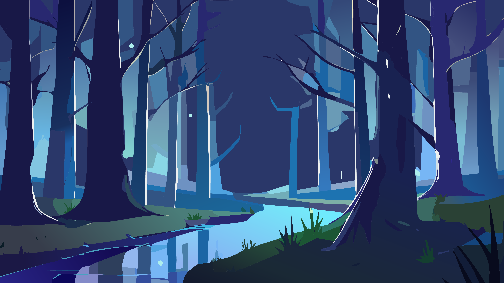

# 🌲🌙 Nachts im Wald 🦉🌌

Ein interaktives Detektivspiel über die Geheimnisse des Waldes bei Nacht. Die Spieler*innen schlüpfen in die Rolle von Detektiv*innen und versuchen herauszufinden, welches Tier gerade erwacht ist.

## 🎯 Ziel des Spiels 🌿🔍

In "Nachts im Wald" geht es darum, durch gezielte Fragen herauszufinden, mit welchem Tier man spricht und welches Tier gerade wach ist. Indem Hinweise gesammelt und Antworten analysiert werden, lüften die Spieler*innen das Geheimnis der Nacht.

## ✨ Features 🍃🌕

### Must Have ✅

- **API-Integration**:
  - [OpenAI-API](https://platform.openai.com/docs/overview) für das Erraten der Tiere
  - [Wikipedia-API](https://www.mediawiki.org/wiki/API:Main_page/de) für Infos über Tiere
- Grundständige Komponenten unter src/components
  - Komponenten, die vom Router gerendert werden unter `/src/routes`
- **Routing**: Zwei Hauptseiten:
  - `/` (Startseite) – Einführung und Weiterleitung zur Detektivansicht
  - `/spielanleitung` – Übersicht aller Spielregeln
- **UI-Elemente**:
  - Eingabefelder für Fragen
  - Buttons (z. B. Toggle-Buttons für Ansichtwechsel)
  - Mond-Button (Button für Überleitung zur Spieleansicht)🌕
  - Karten, die geflippt werden können
- **Hintergrundmusik**: Atmosphärische Klänge passend zur jeweiligen Szene.
- **Interaktionsmöglichkeiten**:
  - Fragen stellen, um das erwachte Tier zu identifizieren
  - Hinweise sammeln und analysieren
  - Karten umdrehen, um mehr Informationen zu erhalten

### Should Have 🌲🔥

- **Responsives Design**: Anpassung für Desktop und Mobile (min. 1 Breakpoint)
- **Flexbox & Grid**: Sinnvolle Strukturierung des Layouts

### Could Have 🌌🦊

- **Automatische Farbwechsel**: Die Szenenfarben ändern sich dynamisch basierend auf den verschiedenen Waldansichten.
- **Vorschau-Buttons für Ansichten**: Buttons, die eine Vorschau der anderen Ansichten bieten, damit Spieler die verschiedenen Szenen und Tiere sehen können, bevor sie wechseln.
- **Glühwürmchen-Animationen**: Random generierte Glühwürmchen (Firefly Particles) fliegen durch den Bildschirm und sorgen für eine mystische Atmosphäre.
- **Button-Animationen**: Beim mit der Maus hovern, erscheint der Button heller.
- **Konfetti-Feier**: Eine spaßige Überraschung für das richtige Erraten des Tieres mit Konfetti.
- **Richtig oder Falsch**: Eine Tada- oder Kopfschütteln Animation für das richtige oder falsche Tier.

## 📜 Themenidee 🌿🌠

Ein immersives Spielerlebnis, das Natur und Detektivarbeit kombiniert:

- **Ratespiel** (Welches Tier ist erwacht?)
- **Detektivspiel** (Sammle Hinweise und stelle Fragen)

## 💡 Licht an 🕵️‍♀️🔦

- Wenn ich mehr Zeit gehabt hätte, hätte ich gerne noch eine Taschenlampe als Cursor in das Projekt integriert. Dies hätte den Spieler*innen das Gefühl gegeben, tatsächlich eine Lichtquelle in der Dunkelheit zu verwenden.
